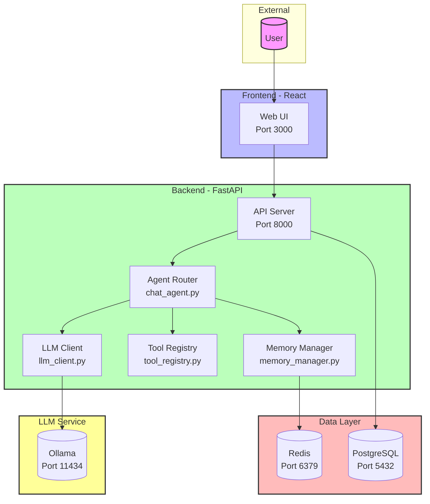
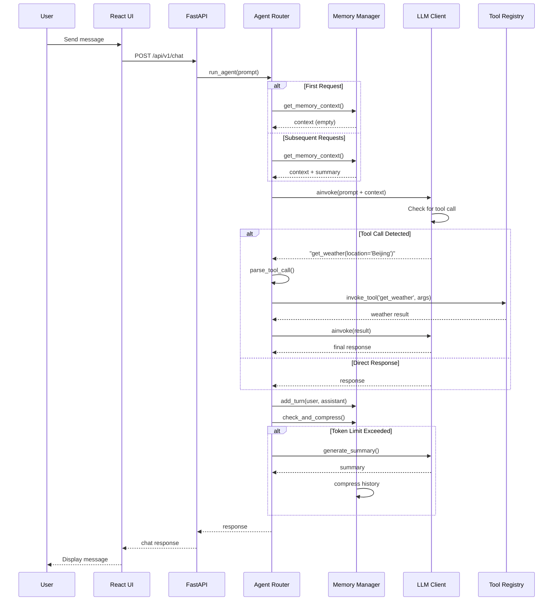

# AI SaaS Week1 Scaffold

A minimal monorepo scaffold for an AI SaaS starter project.

## Architecture



## AI Workflow



## Structure

```
ai-saas-week1/
├── app/
│   ├── backend/              # FastAPI backend
│   │   ├── src/
│   │   │   ├── agents/       # Agent modules (chat_agent, llm_client, etc.)
│   │   │   ├── models/       # SQLAlchemy models
│   │   │   ├── routes/       # API routes
│   │   │   ├── schemas/      # Pydantic schemas
│   │   │   └── main.py       # Application entry
│   │   ├── tests/            # pytest tests
│   │   └── Dockerfile
│   └── web/                  # React frontend
│       ├── src/
│       └── package.json
├── infra/                    # Docker infrastructure
├── docs/                     # Architecture docs
├── scripts/                  # Helper scripts
└── docker-compose.yml
```

## Prerequisites

- Docker & Docker Compose
- (Optional) OpenAI API key if using OpenAI instead of Ollama

## Quick Start

1. Copy env template:

   ```bash
   cp .env.example .env
   ```

2. Start all services:

   ```bash
   docker-compose up --build
   ```

   This will automatically:

   - Start PostgreSQL, Redis, and Ollama containers
   - Run database migrations
   - Ollama will check if the required model (mistral) exists, and pull it if needed

3. Access the web interface at http://localhost:3000

## LLM Configuration

By default, the application uses **Ollama** with the Mistral model running in a Docker container.

### Option A: Ollama (Default)

```env
OLLAMA_MODEL=mistral
OLLAMA_BASE_URL=http://ollama:11434
```

The docker-compose.yml includes an Ollama container that automatically checks for and pulls the configured model on startup.

### Option B: OpenAI / DashScope

If you prefer using OpenAI or a compatible API (like Alibaba DashScope):

```env
OLLAMA_MODEL=
OPENAI_API_KEY=sk-your-api-key-here
OPENAI_MODEL=qwen3.6-plus
OPENAI_BASE_URL=https://coding.dashscope.aliyuncs.com/v1
```

## Environment Variables

| Variable          | Description                  | Default                                                  |
| ----------------- | ---------------------------- | -------------------------------------------------------- |
| `DATABASE_URL`    | PostgreSQL connection string | `postgresql+asyncpg://postgres:postgres@db:5432/ai_saas` |
| `REDIS_URL`       | Redis connection string      | `redis://redis:6379/0`                                   |
| `OLLAMA_MODEL`    | Ollama model name            | `mistral`                                                |
| `OLLAMA_BASE_URL` | Ollama server URL            | `http://ollama:11434`                                    |
| `OPENAI_API_KEY`  | OpenAI/DashScope API key     | (empty)                                                  |
| `OPENAI_MODEL`    | API model name               | `gpt-3.5-turbo`                                          |
| `OPENAI_BASE_URL` | API base URL                 | (empty)                                                  |

## Services

| Service | Port  | Description         |
| ------- | ----- | ------------------- |
| web     | 3000  | React frontend      |
| backend | 8000  | FastAPI backend     |
| db      | 5432  | PostgreSQL database |
| redis   | 6379  | Redis cache         |
| ollama  | 11434 | Ollama LLM server   |

## Agent Modules

The agent system is split into modular components:

| Module              | Responsibility                        |
| ------------------- | ------------------------------------- |
| `llm_client.py`     | LLM client management (Ollama/OpenAI) |
| `tool_registry.py`  | Tool registration and invocation      |
| `memory_manager.py` | Session memory with auto-compression  |
| `agent_router.py`   | Core agent logic and tool parsing     |

### Memory Management

The `MemoryManager` handles conversation history with automatic token-based compression:

- **Threshold**: Triggers compression when tokens exceed 2000
- **Summary**: Uses LLM to generate a summary of conversation history
- **Retention**: Keeps only the last 5 conversation turns after compression

### Tool System

Available tools registered in `ToolRegistry`:

- `get_weather(location)` - Get weather for a city
- `get_current_time(timezone)` - Get current time
- `calculate(expression)` - Execute math calculations

## Development

### Running Tests

```bash
cd app/backend
pip install pytest pytest-asyncio pytest-mock pytest-cov
PYTHONPATH=. pytest tests/ -v --cov=src/agents/
```

### Local Backend Development

```bash
cd app/backend
uvicorn app.main:app --reload --port 8000
```

## License

MIT
