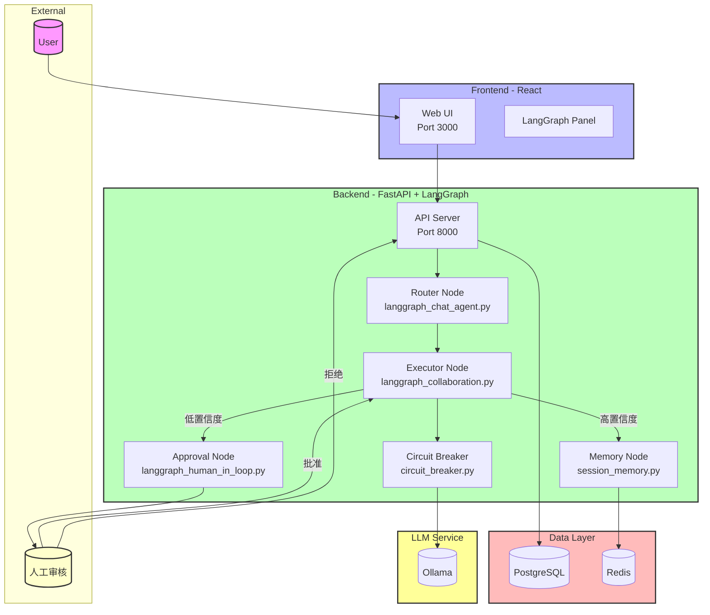
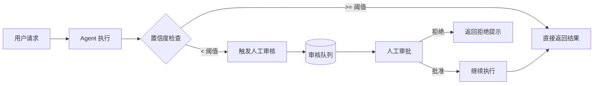

# Week 2: 多 Agent 编排与状态机架构

> **本周目标**: 从单 Agent 升级到 LangGraph 多智能体状态机，实现任务路由、人工介入与记忆隔离。

---

## 第一部分：本周学习计划与目标

### 7 天学习路线

|   天数    | 主题                                           | 学习目标                                           |
| :-------: | :--------------------------------------------- | :------------------------------------------------- |
| **Day 1** | LangGraph 基础 - State Schema / Nodes / Edges  | 掌握 LangGraph 核心概念，理解状态机编程模型        |
| **Day 2** | 构建 Router → Executor → Reviewer 协作链       | 实现多 Agent 协作链，理解节点间数据传递与条件路由  |
| **Day 3** | Human-in-the-Loop 中断点与审批恢复             | 实现人工介入机制，让 AI 在关键节点暂停等待人类决策 |
| **Day 4** | 会话级记忆隔离 (独立 State 存储)               | 实现多会话并发隔离，每会话独立记忆上下文           |
| **Day 5** | 容错降级 (超时熔断 / 指数退避 / 拒绝 fallback) | 实现生产级容错机制，保证系统稳定性                 |
| **Day 6** | 迁移 W1 Agent 至 LangGraph + 补充测试          | 将 Week1 的单 Agent 迁移到 LangGraph 状态机架构    |
| **Day 7** | langgraph-cli 可视化轨迹图 + 并发测试          | 实现执行轨迹可视化，掌握并发压力测试方法           |

### 本周核心目标

1. **LangGraph 状态机架构**: 掌握 State Schema、Nodes、Edges、Conditional Edges 等核心概念
2. **多 Agent 协作**: 实现 Router → Executor → Reviewer 协作链，支持动态路由
3. **人机协同**: 低置信度自动触发人工审核，审批通过后恢复执行
4. **记忆隔离**: 多会话并发无状态污染，独立 State 存储
5. **容错机制**: 超时熔断、指数退避、拒绝降级，保证系统稳定性

---

## 第二部分：Sample Project 介绍

### 项目概述

本项目是一个**基于 LangGraph 的多 Agent 编排系统**，在 Week 1 基础上升级：

- 使用 LangGraph 状态机替代单 Agent 循环
- 实现 Router → Executor → Reviewer 多 Agent 协作链
- 支持 Human-in-the-Loop 人工审批机制
- 会话级记忆隔离，多并发无状态污染
- 熔断器、指数退避等容错降级机制

### 系统架构



### 技术栈

| 层级       | 技术                                               | 版本                   |
| ---------- | -------------------------------------------------- | ---------------------- |
| **前端**   | React, TypeScript, Vite, Tailwind CSS, Zustand     | React 19               |
| **后端**   | Python, FastAPI, SQLAlchemy 2.0, Alembic, Pydantic | Python 3.12            |
| **AI/LLM** | LangChain, LangGraph, Ollama                       | LangGraph 0.2          |
| **数据库** | PostgreSQL, Redis                                  | PostgreSQL 16, Redis 7 |
| **部署**   | Docker, Docker Compose                             | -                      |

### 核心功能模块

#### 1. LangGraph 工作流引擎

| 模块              | 功能描述                     | 关键文件                                |
| ----------------- | ---------------------------- | --------------------------------------- |
| **状态机基础**    | State Schema / Nodes / Edges | `src/agents/langgraph_basics.py`        |
| **聊天 Agent**    | 状态机聊天工作流             | `src/agents/langgraph_chat_agent.py`    |
| **多 Agent 协作** | Router → Executor → Reviewer | `src/agents/langgraph_collaboration.py` |
| **人机协同**      | Human-in-the-Loop 审批节点   | `src/agents/langgraph_human_in_loop.py` |

#### 2. 人机协同工作流



**功能特性**:

- 低置信度自动触发人工审核
- 审批状态持久化存储
- 审批通过后恢复执行
- 拒绝时返回友好提示

#### 3. 会话级记忆隔离

| 功能                | 描述                 |
| ------------------- | -------------------- |
| **独立 State 存储** | 每个会话独立记忆状态 |
| **上下文压缩**      | 长对话自动摘要       |
| **记忆检索**        | 相关性历史消息召回   |

#### 4. 容错与降级机制

| 机制         | 实现方式                  |
| ------------ | ------------------------- |
| **超时熔断** | 工具调用超时自动 fallback |
| **指数退避** | 重试间隔指数增长          |
| **拒绝降级** | LLM 拒绝时返回预设提示    |
| **熔断器**   | 连续失败快速失败          |

### 项目结构

```
ai-saas-week2/
├── app/
│   ├── backend/
│   │   ├── src/
│   │   │   ├── agents/
│   │   │   │   ├── langgraph_basics.py        # LangGraph 基础
│   │   │   │   ├── langgraph_chat_agent.py    # 状态机聊天 Agent
│   │   │   │   ├── langgraph_collaboration.py # 多 Agent 协作
│   │   │   │   └── langgraph_human_in_loop.py # 人机协同
│   │   │   ├── routes/v1/
│   │   │   │   └── chat.py                    # 聊天 API
│   │   │   ├── utils/
│   │   │   │   ├── circuit_breaker.py         # 熔断器
│   │   │   │   └── session_memory.py          # 会话记忆
│   │   │   └── main.py                        # FastAPI 入口
│   │   ├── tests/
│   │   │   ├── test_langgraph_chat_agent.py   # LangGraph Agent 测试
│   │   │   ├── test_langgraph_human_in_loop.py # 人机协同测试
│   │   │   └── test_concurrency.py            # 并发测试
│   │   ├── Dockerfile
│   │   └── requirements.txt
│   │
│   └── web/
│       ├── src/
│       │   ├── components/
│       │   │   └── LangGraphPanel.tsx         # LangGraph 可视化面板
│       │   ├── store/
│       │   │   └── chatStore.ts               # 状态管理
│       │   └── types/
│       ├── e2e/tests/
│       │   ├── human-in-loop.spec.ts          # 人机协同测试
│       │   └── history.spec.ts                # 历史记录测试
│       ├── Dockerfile
│       └── package.json
│
├── docker-compose.yml
└── README.md
```

### 快速开始

#### 环境要求

- Docker & Docker Compose
- Python 3.12+ (可选)
- Node.js 20+ (可选)

#### 启动服务

```bash
# 1. 进入项目目录
cd ai-saas-week2

# 2. 配置环境变量
cp .env.example .env

# 3. 启动所有服务
docker compose up -d

# 4. 查看服务状态
docker compose ps

# 5. 启动 LangGraph 可视化（可选）
langgraph dev
```

#### 服务端口

| 服务       | 端口  | 说明           |
| ---------- | ----- | -------------- |
| Web UI     | 3000  | React 前端     |
| API        | 8000  | FastAPI 后端   |
| PostgreSQL | 5432  | 关系数据库     |
| Redis      | 6379  | 缓存与会话存储 |
| Ollama     | 11434 | 本地 LLM 服务  |

### API 文档

- **Swagger UI**: http://localhost:8000/docs
- **ReDoc**: http://localhost:8000/redoc

#### 主要 API 端点

| 端点                                | 方法 | 说明         |
| ----------------------------------- | ---- | ------------ |
| `/api/v1/chat/`                     | POST | 聊天对话     |
| `/api/v1/chat/approval/{id}`        | POST | 提交审批结果 |
| `/api/v1/chat/history/{session_id}` | GET  | 获取聊天历史 |
| `/api/v1/health/`                   | GET  | 服务健康检查 |

#### 使用示例

```bash
# 发送聊天请求
curl -X POST http://localhost:8000/api/v1/chat/ \
  -H "Content-Type: application/json" \
  -d '{
    "message": "分析一下这个财务报表",
    "session_id": "session_123"
  }'

# 提交审批
curl -X POST http://localhost:8000/api/v1/chat/approval/approval_456 \
  -H "Content-Type: application/json" \
  -d '{
    "approved": true,
    "comment": "已审核通过"
  }'
```

### 测试

#### 后端单元测试

```bash
cd app/backend
PYTHONPATH=. pytest tests/ -v

# 运行特定测试
PYTHONPATH=. pytest tests/test_langgraph_chat_agent.py -v
PYTHONPATH=. pytest tests/test_langgraph_human_in_loop.py -v
PYTHONPATH=. pytest tests/test_concurrency.py -v
```

#### 前端 E2E 测试

```bash
cd app/web
npm run test:e2e
```

### 验收标准

- ✅ 低置信度自动触发人工审核
- ✅ 多会话并发无状态污染
- ✅ 执行 DAG 图清晰可追溯
- ✅ 超时/熔断/降级机制正常工作
- ✅ 人机协同流程完整可用

---

## 第三部分：总结

### 学习目标实现情况

本项目通过构建一个基于 LangGraph 的多 Agent 编排系统，实现了 Week 2 的所有学习目标：

| 学习目标             | 实现方式                                         | 关键代码                                |
| -------------------- | ------------------------------------------------ | --------------------------------------- |
| **LangGraph 状态机** | State Schema / Nodes / Edges / Conditional Edges | `src/agents/langgraph_basics.py`        |
| **多 Agent 协作**    | Router → Executor → Reviewer 协作链              | `src/agents/langgraph_collaboration.py` |
| **人机协同**         | 低置信度触发人工审核，审批后恢复执行             | `src/agents/langgraph_human_in_loop.py` |
| **记忆隔离**         | 独立 State 存储，多会话并发隔离                  | `src/utils/session_memory.py`           |
| **容错降级**         | 熔断器、指数退避、拒绝 fallback                  | `src/utils/circuit_breaker.py`          |
| **可视化轨迹**       | 执行轨迹记录与 Mermaid 序列图                    | `langgraph dev`                         |
| **并发测试**         | 100 并发请求测试                                 | `tests/test_concurrency.py`             |

### 知识重点

1. **LangGraph 状态机编程**: 理解 State Schema 设计、Node 函数、Edge 连接、Conditional Edge 动态路由
2. **多 Agent 协作模式**: Router 负责意图识别，Executor 负责工具执行，Reviewer 负责结果质量检查
3. **Human-in-the-Loop 设计**: 使用 `interrupt` 机制实现暂停，使用 `MemorySaver` 实现状态持久化
4. **会话隔离机制**: 通过 `thread_id` 隔离不同会话的 State，使用 Redis 缓存加速
5. **容错设计模式**: 熔断器（Circuit Breaker）、指数退避（Exponential Backoff）、降级（Fallback）

### Reference Links

- [Week 2 详细学习计划](../learning-plan/week2/learning-plan-original.md)
- [AI SaaS 全景路线图](../learning-plan/ai_saas_learning_plan/overall_learning_plan.md)
- [LangGraph 文档](https://langchain-ai.github.io/langgraph/)
- [LangChain 文档](https://python.langchain.com/)
- [Circuit Breaker Pattern](https://martinfowler.com/bliki/CircuitBreaker.html)
