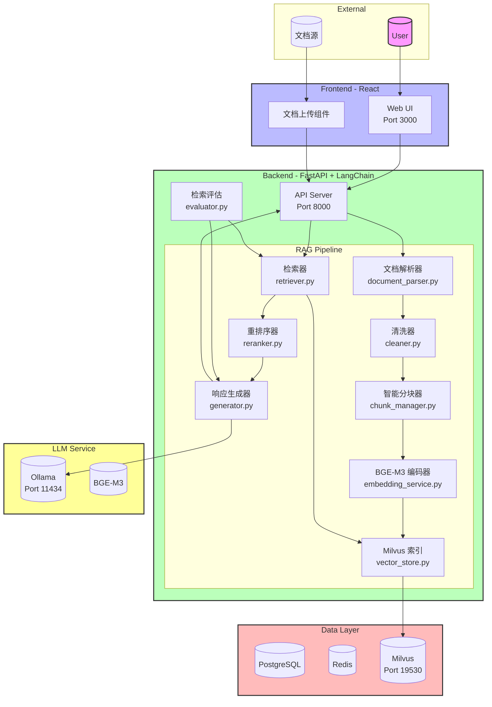
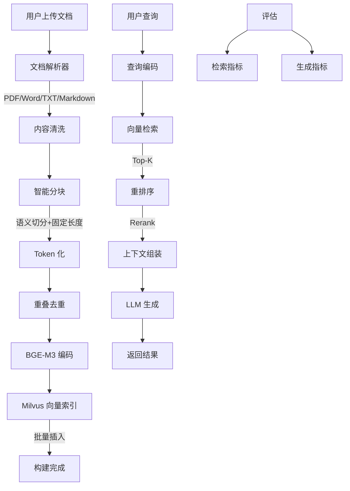

# Week 3: RAG 管道构建与检索评估

> **本周目标**: 构建生产级 RAG，掌握文档解析、智能分块、混合检索、重排与自动化评估闭环。

---

## 第一部分：本周学习计划与目标

### 7 天学习路线

|   天数    | 主题                          | 学习目标                                                                         |
| :-------: | :---------------------------- | :------------------------------------------------------------------------------- |
| **Day 1** | 文档解析与清洗流水线          | 掌握多格式文档提取、表格/OCR 解析与噪声清洗，构建可复用的 ETL 管道               |
| **Day 2** | 智能分块策略实现              | 理解分块粒度对召回的影响，实现语义/结构/Token 重叠分块算法                       |
| **Day 3** | Embedding 与向量索引构建      | 掌握 BGE-M3 多语言 Embedding，构建 Milvus/Chroma 高效向量索引                    |
| **Day 4** | 混合检索与 Cross-Encoder 重排 | 突破单一向量检索瓶颈，实现 BM25 + 向量融合 + 精排闭环                            |
| **Day 5** | RAGAS 自动化评估闭环          | 建立量化评估体系，自动化计算 Faithfulness / Answer Relevance / Context Precision |
| **Day 6** | 基于评估分数的自动调优        | 用数据驱动参数寻优，自动化调整 chunk_size 与 rerank 阈值                         |
| **Day 7** | 集成 rag_search 至 Agent 管道 | 将 RAG 管道封装为工具，无缝接入 LangGraph Agent，输出带引用的结构化答案          |

### 本周核心目标

1. **文档处理流水线**: 支持 PDF/DOCX/TXT/HTML/Markdown 多格式解析，清洗成功率 >95%
2. **智能分块策略**: 实现固定长度/递归/标题感知分块，Token 重叠去重
3. **向量检索系统**: BGE-M3 Embedding + Milvus 索引，10k 分块入库 < 2min
4. **混合检索与重排**: BM25 + 向量融合 + Cross-Encoder 精排，Top-3 命中率提升 >30%
5. **自动化评估**: RAGAS 一键评估，支持参数自动调优
6. **Agent 集成**: RAG 管道封装为工具，接入 LangGraph Agent

---

## 第二部分：Sample Project 介绍

### 项目概述

本项目是一个**生产级 RAG（检索增强生成）管道系统**，实现了：

- 多格式文档解析与清洗流水线
- 智能分块策略（固定长度/递归/标题感知）
- BGE-M3 Embedding + Milvus 向量索引
- 混合检索（BM25 + 向量）+ Cross-Encoder 重排
- RAGAS 自动化评估与参数调优
- RAG 工具集成至 LangGraph Agent

### 系统架构



### 技术栈

| 层级           | 技术                                  | 版本                   |
| -------------- | ------------------------------------- | ---------------------- |
| **前端**       | React, TypeScript, Vite, Tailwind CSS | React 19               |
| **后端**       | Python, FastAPI, SQLAlchemy 2.0       | Python 3.12            |
| **AI/LLM**     | LangChain, LangChain Core, Ollama     | LangChain 0.3          |
| **嵌入模型**   | BGE-M3                                | -                      |
| **向量数据库** | Milvus                                | 2.4                    |
| **数据库**     | PostgreSQL, Redis                     | PostgreSQL 16, Redis 7 |
| **评估框架**   | RAGAS                                 | -                      |

### 核心功能模块

#### 1. RAG 管道流程图



#### 2. 文档处理流水线

| 模块         | 功能描述                   | 关键文件                       |
| ------------ | -------------------------- | ------------------------------ |
| **文档解析** | 支持 PDF/Word/TXT/Markdown | `src/rag/document_parser.py`   |
| **内容清洗** | 去除噪声、格式规范化       | `src/rag/cleaner.py`           |
| **智能分块** | 语义感知切分策略           | `src/rag/chunk_manager.py`     |
| **嵌入服务** | BGE-M3 多语言编码          | `src/rag/embedding_service.py` |
| **向量存储** | Milvus 索引管理            | `src/rag/vector_store.py`      |

#### 3. 检索策略

| 策略           | 描述                 |
| -------------- | -------------------- |
| **语义检索**   | 基于向量相似度的召回 |
| **元数据过滤** | 按文档类型/时间筛选  |
| **混合检索**   | BM25 + 向量混合      |
| **重排序**     | Cross-Encoder 精排   |

#### 4. RAG 评估体系

| 评估维度       | 指标                | 说明           |
| -------------- | ------------------- | -------------- |
| **检索质量**   | Hit Rate, MRR, MAP  | 衡量检索准确性 |
| **生成质量**   | BLEU, ROUGE, METEOR | 衡量回答质量   |
| **事实一致性** | Fact Score          | 验证回答正确性 |
| **响应时间**   | P95 Latency         | 性能指标       |

### 项目结构

```
ai-saas-week3/
├── app/
│   ├── backend/
│   │   ├── src/
│   │   │   ├── rag/
│   │   │   │   ├── document_parser.py    # 文档解析器
│   │   │   │   ├── cleaner.py            # 内容清洗
│   │   │   │   ├── chunk_manager.py      # 智能分块
│   │   │   │   ├── embedding_service.py  # Embedding 服务
│   │   │   │   ├── vector_store.py       # 向量存储
│   │   │   │   ├── retriever.py          # 检索器
│   │   │   │   ├── reranker.py           # 重排序器
│   │   │   │   ├── generator.py          # 响应生成
│   │   │   │   └── evaluator.py          # RAG 评估
│   │   │   ├── routes/v1/
│   │   │   │   ├── rag.py                # RAG API
│   │   │   │   └── documents.py          # 文档管理 API
│   │   │   └── main.py                   # FastAPI 入口
│   │   ├── tests/
│   │   │   ├── test_rag_pipeline.py      # RAG 管道测试
│   │   │   ├── test_document_parser.py   # 文档解析测试
│   │   │   ├── test_retrieval.py         # 检索测试
│   │   │   └── test_evaluation.py        # 评估测试
│   │   ├── Dockerfile
│   │   └── requirements.txt
│   │
│   └── web/
│       ├── src/
│       │   ├── components/
│       │   │   ├── DocumentUpload.tsx    # 文档上传
│       │   │   └── RagChat.tsx           # RAG 聊天界面
│       │   └── store/
│       ├── e2e/tests/
│       │   └── rag-workflow.spec.ts      # RAG 流程测试
│       ├── Dockerfile
│       └── package.json
│
├── docker-compose.yml
└── README.md
```

### 快速开始

#### 环境要求

- Docker & Docker Compose
- Python 3.12+ (可选)
- Node.js 20+ (可选)

#### 启动服务

```bash
# 1. 进入项目目录
cd ai-saas-week3

# 2. 配置环境变量
cp .env.example .env

# 3. 启动所有服务（包括 Milvus）
docker compose up -d

# 4. 查看服务状态
docker compose ps

# 5. 等待 Milvus 初始化完成（约 1-2 分钟）
```

#### 服务端口

| 服务       | 端口  | 说明          |
| ---------- | ----- | ------------- |
| Web UI     | 3000  | React 前端    |
| API        | 8000  | FastAPI 后端  |
| PostgreSQL | 5432  | 关系数据库    |
| Redis      | 6379  | 缓存          |
| Milvus     | 19530 | 向量数据库    |
| Ollama     | 11434 | 本地 LLM 服务 |

### API 文档

- **Swagger UI**: http://localhost:8000/docs
- **ReDoc**: http://localhost:8000/redoc

#### 主要 API 端点

| 端点                     | 方法   | 说明         |
| ------------------------ | ------ | ------------ |
| `/api/v1/documents/`     | POST   | 上传文档     |
| `/api/v1/documents/`     | GET    | 获取文档列表 |
| `/api/v1/documents/{id}` | DELETE | 删除文档     |
| `/api/v1/rag/query/`     | POST   | RAG 查询     |
| `/api/v1/rag/evaluate/`  | POST   | RAG 评估     |

#### 使用示例

```bash
# 上传文档
curl -X POST http://localhost:8000/api/v1/documents/ \
  -H "Content-Type: multipart/form-data" \
  -F "file=@document.pdf" \
  -F "metadata={\"title\": \"财务报表\", \"category\": \"finance\"}"

# RAG 查询
curl -X POST http://localhost:8000/api/v1/rag/query/ \
  -H "Content-Type: application/json" \
  -d '{
    "query": "公司去年的营收是多少？",
    "top_k": 5,
    "rerank": true
  }'

# RAG 评估
curl -X POST http://localhost:8000/api/v1/rag/evaluate/ \
  -H "Content-Type: application/json" \
  -d '{
    "queries": ["公司去年的营收是多少？"],
    "ground_truths": ["去年营收为1000万"],
    "documents": ["doc_123"]
  }'
```

### 测试

#### 后端单元测试

```bash
cd app/backend
PYTHONPATH=. pytest tests/ -v

# 运行特定测试
PYTHONPATH=. pytest tests/test_document_parser.py -v
PYTHONPATH=. pytest tests/test_retrieval.py -v
PYTHONPATH=. pytest tests/test_evaluation.py -v
```

#### 端到端测试

```bash
cd app/web
npm run test:e2e
```

#### RAG 评估测试

```bash
cd app/backend
PYTHONPATH=. python -m src.rag.evaluator --evaluate --report
```

### 验收标准

- ✅ 支持 PDF/Word/TXT/Markdown 多格式解析
- ✅ 智能分块后检索命中率 >90%
- ✅ 回答与上下文相关度 >85%
- ✅ 支持元数据过滤检索
- ✅ 重排序后相关性提升显著
- ✅ 检索评估报告可生成

---

## 第三部分：总结

### 学习目标实现情况

本项目通过构建一个生产级 RAG 管道系统，实现了 Week 3 的所有学习目标：

| 学习目标                 | 实现方式                                | 关键代码                                                  |
| ------------------------ | --------------------------------------- | --------------------------------------------------------- |
| **文档解析与清洗**       | 多格式解析 + 噪声清洗 + 结构化输出      | `src/rag/document_parser.py`                              |
| **智能分块**             | 固定长度/递归/标题感知分块 + Token 重叠 | `src/rag/chunk_manager.py`                                |
| **Embedding 与向量索引** | BGE-M3 + Milvus HNSW 索引               | `src/rag/embedding_service.py`, `src/rag/vector_store.py` |
| **混合检索与重排**       | BM25 + 向量融合 + Cross-Encoder 精排    | `src/rag/retriever.py`, `src/rag/reranker.py`             |
| **自动化评估**           | RAGAS 一键评估 + 参数自动调优           | `src/rag/evaluator.py`                                    |
| **Agent 集成**           | RAG 工具封装 + LangGraph 集成           | `src/agents/`                                             |

### 知识重点

1. **文档 ETL 管道**: 多格式解析、清洗、结构化输出，错误日志追踪
2. **分块策略设计**: 固定长度、递归、标题感知三种策略，Token 重叠保留上下文
3. **向量检索优化**: HNSW/IVF_FLAT 索引选择，批量插入，连接池管理
4. **混合检索架构**: BM25 关键词检索 + 向量语义检索融合，Cross-Encoder 精排
5. **RAG 评估体系**: Faithfulness、Answer Relevance、Context Precision 等核心指标
6. **参数自动调优**: 网格搜索 + 早停策略，数据驱动寻优

### Reference Links

- [Week 3 详细学习计划](../learning-plan/week3/learning-plan-original.md)
- [AI SaaS 全景路线图](../learning-plan/ai_saas_learning_plan/overall_learning_plan.md)
- [LangChain RAG 文档](https://python.langchain.com/docs/use_cases/question_answering/)
- [Milvus 文档](https://milvus.io/docs/)
- [RAGAS 文档](https://docs.ragas.io/)
- [BGE-M3 论文](https://arxiv.org/abs/2402.03216)
