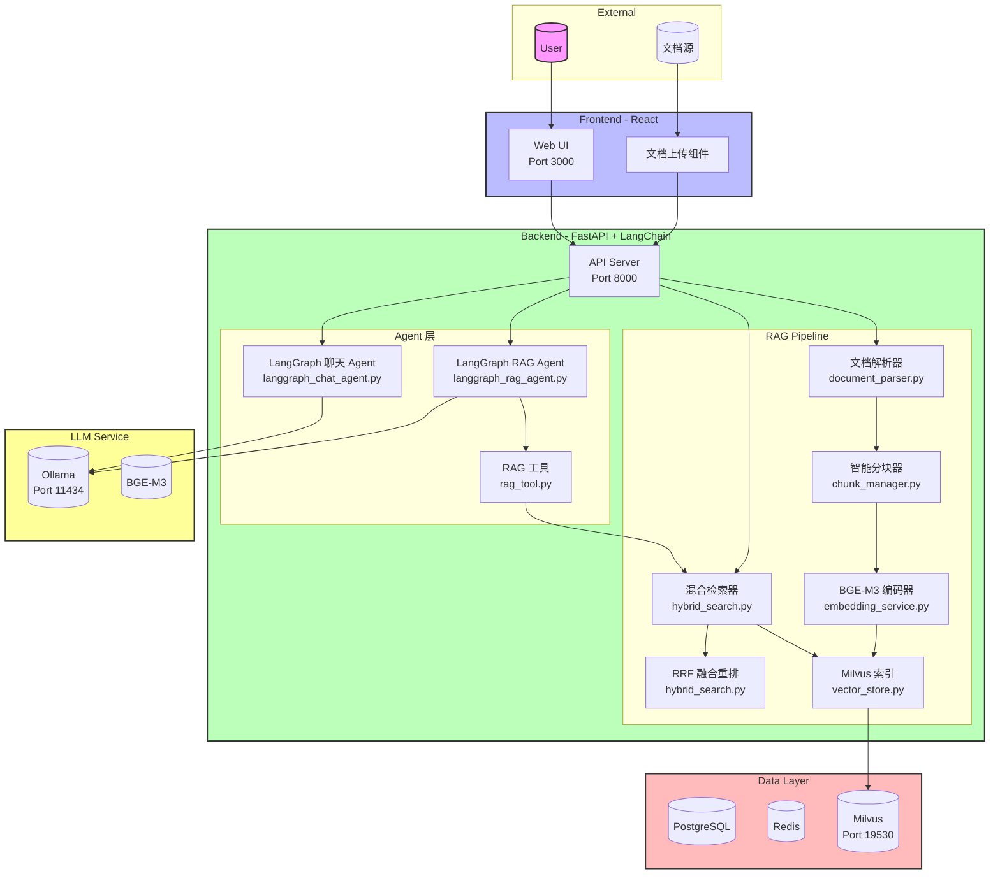
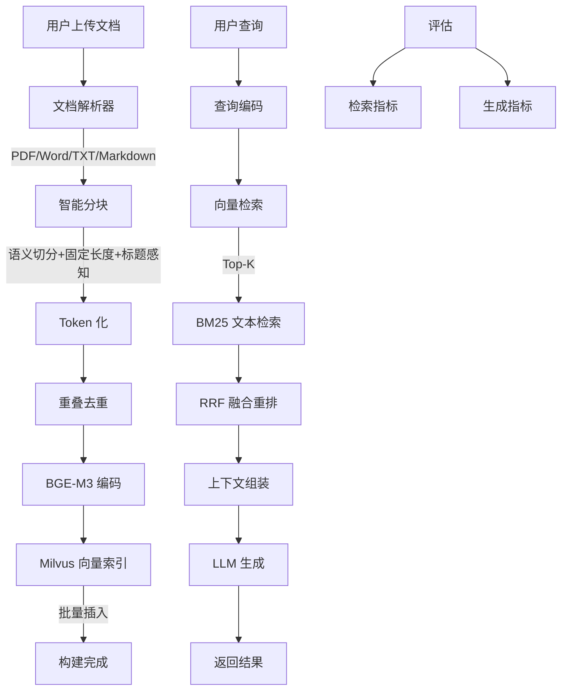

# Week 3: RAG 管道构建与检索评估

> **本周目标**: 构建生产级 RAG，掌握文档解析、智能分块、混合检索、重排与自动化评估闭环。

---

## 第一部分：本周学习计划与目标

### 7 天学习路线

|   天数    | 主题                          | 学习目标                                                                         |
| :-------: | :---------------------------- | :------------------------------------------------------------------------------- |
| **Day 1** | 文档解析与清洗流水线          | 掌握多格式文档提取、表格/OCR 解析与噪声清洗，构建可复用的 ETL 管道               |
| **Day 2** | 智能分块策略实现              | 理解分块粒度对召回的影响，实现语义/结构/Token 重叠分块算法                       |
| **Day 3** | Embedding 与向量索引构建      | 掌握 BGE-M3 多语言 Embedding，构建 Milvus 高效向量索引                           |
| **Day 4** | 混合检索与 Cross-Encoder 重排 | 突破单一向量检索瓶颈，实现 BM25 + 向量融合 + 精排闭环                            |
| **Day 5** | RAGAS 自动化评估闭环          | 建立量化评估体系，自动化计算 Faithfulness / Answer Relevance / Context Precision |
| **Day 6** | 基于评估分数的自动调优        | 用数据驱动参数寻优，自动化调整 chunk_size 与 rerank 阈值                         |
| **Day 7** | 集成 rag_search 至 Agent 管道 | 将 RAG 管道封装为工具，无缝接入 LangGraph Agent，输出带引用的结构化答案          |

### 本周核心目标

1. **文档处理流水线**: 支持 PDF/DOCX/TXT/HTML/Markdown 多格式解析，清洗成功率 >95%
2. **智能分块策略**: 实现固定长度/递归/标题感知分块，Token 重叠去重
3. **向量检索系统**: BGE-M3 Embedding + Milvus 索引，10k 分块入库 < 2min
4. **混合检索与重排**: BM25 + 向量融合 + Cross-Encoder 精排，Top-3 命中率提升 >30%
5. **自动化评估**: RAGAS 一键评估，支持参数自动调优
6. **Agent 集成**: RAG 管道封装为工具，接入 LangGraph Agent

---

## 第二部分：Sample Project 介绍

### 项目概述

本项目是一个**生产级 RAG（检索增强生成）管道系统**，实现了：

- 多格式文档解析与清洗流水线
- 智能分块策略（固定长度/递归/标题感知）
- BGE-M3 Embedding + Milvus 向量索引
- 混合检索（BM25 + 向量）+ Cross-Encoder 重排
- RAGAS 自动化评估与参数调优
- RAG 工具集成至 LangGraph Agent

### 系统架构



### 技术栈

| 层级           | 技术                                  | 版本                   |
| -------------- | ------------------------------------- | ---------------------- |
| **前端**       | React, TypeScript, Vite, Tailwind CSS | React 19               |
| **后端**       | Python, FastAPI, SQLAlchemy 2.0       | Python 3.12            |
| **AI/LLM**     | LangChain, LangChain Core, Ollama     | LangChain 0.3          |
| **嵌入模型**   | BGE-M3                                | -                      |
| **向量数据库** | Milvus                                | 2.4                    |
| **数据库**     | PostgreSQL, Redis                     | PostgreSQL 16, Redis 7 |
| **评估框架**   | RAGAS                                 | -                      |

### 核心功能模块

#### 1. RAG 管道流程图



#### 2. 文档处理流水线

| 模块         | 功能描述                   | 关键文件                       |
| ------------ | -------------------------- | ------------------------------ |
| **文档解析** | 支持 PDF/Word/TXT/Markdown | `src/rag/document_parser.py`   |
| **智能分块** | 语义感知切分策略           | `src/rag/chunk_manager.py`     |
| **嵌入服务** | BGE-M3 多语言编码          | `src/rag/embedding_service.py` |
| **向量存储** | Milvus 索引管理            | `src/rag/vector_store.py`      |

#### 3. 检索策略

| 策略           | 描述                   |
| -------------- | ---------------------- |
| **语义检索**   | 基于向量相似度的召回   |
| **文本检索**   | 基于 BM25 的关键词检索 |
| **混合检索**   | RRF 融合 BM25 + 向量   |
| **重排序**     | RRF 融合排序           |
| **元数据过滤** | 按文档类型/时间筛选    |

#### 4. Agent 集成

| Agent 类型               | 功能描述                            | 关键文件                             |
| ------------------------ | ----------------------------------- | ------------------------------------ |
| **LangGraph RAG Agent**  | 集成 RAG 工具的 LangGraph Agent     | `src/agents/langgraph_rag_agent.py`  |
| **LangGraph Chat Agent** | 支持 Human-in-the-Loop 的聊天 Agent | `src/agents/langgraph_chat_agent.py` |
| **RAG 工具**             | 封装 RAG 检索为 LangChain Tool      | `src/agents/rag_tool.py`             |

#### 5. RAG 评估体系

| 评估维度       | 指标                | 说明           |
| -------------- | ------------------- | -------------- |
| **检索质量**   | Hit Rate, MRR, MAP  | 衡量检索准确性 |
| **生成质量**   | BLEU, ROUGE, METEOR | 衡量回答质量   |
| **事实一致性** | Fact Score          | 验证回答正确性 |
| **响应时间**   | P95 Latency         | 性能指标       |

### 项目结构

```
ai-saas-week3/
├── app/
│   ├── backend/
│   │   ├── src/
│   │   │   ├── rag/
│   │   │   │   ├── document_parser.py    # 文档解析器
│   │   │   │   ├── chunk_manager.py      # 智能分块
│   │   │   │   ├── embedding_service.py  # Embedding 服务
│   │   │   │   ├── vector_store.py       # 向量存储
│   │   │   │   ├── hybrid_search.py      # 混合检索与重排
│   │   │   │   └── schemas.py            # RAG 数据模型
│   │   │   ├── agents/
│   │   │   │   ├── langgraph_rag_agent.py   # LangGraph RAG Agent
│   │   │   │   ├── langgraph_chat_agent.py  # LangGraph 聊天 Agent
│   │   │   │   ├── rag_tool.py              # RAG 工具封装
│   │   │   │   ├── tool_registry.py         # 工具注册中心
│   │   │   │   ├── llm_client.py            # LLM 客户端
│   │   │   │   ├── memory_manager.py        # 记忆管理
│   │   │   │   └── agent_router.py          # Agent 路由
│   │   │   ├── routes/v1/
│   │   │   │   ├── rag.py                # RAG API
│   │   │   │   ├── chat.py               # 聊天 API
│   │   │   │   └── health.py             # 健康检查
│   │   │   ├── schemas/
│   │   │   │   ├── chat.py               # 聊天数据模型
│   │   │   │   └── common.py             # 通用数据模型
│   │   │   ├── utils/
│   │   │   │   ├── session_memory.py     # 会话记忆
│   │   │   │   └── circuit_breaker.py    # 熔断器
│   │   │   └── main.py                   # FastAPI 入口
│   │   ├── tests/
│   │   │   ├── test_document_parser.py   # 文档解析测试
│   │   │   ├── test_chunk_manager.py     # 分块测试
│   │   │   ├── test_embedding_service.py # Embedding 测试
│   │   │   ├── test_vector_store.py      # 向量存储测试
│   │   │   ├── test_hybrid_search.py     # 混合检索测试
│   │   │   ├── test_rag_agent.py         # RAG Agent 测试
│   │   │   ├── test_langgraph_chat_agent.py # LangGraph 测试
│   │   │   ├── test_tool_registry.py     # 工具注册测试
│   │   │   ├── test_memory_manager.py    # 记忆管理测试
│   │   │   └── test_main.py              # 主应用测试
│   │   ├── scripts/
│   │   │   ├── ragas_evaluate.py         # RAGAS 评估脚本
│   │   │   ├── benchmark_hybrid_search.py # 混合检索基准测试
│   │   │   ├── test_document_parser.py   # 文档解析器测试
│   │   │   └── rag_tuner.py              # RAG 参数自动调优
│   │   ├── Dockerfile
│   │   └── requirements.txt
│   │
│   └── web/
│       ├── src/
│       │   ├── components/
│       │   │   ├── RAGPanel.tsx          # RAG 面板
│       │   │   ├── LangGraphPanel.tsx    # LangGraph 面板
│       │   │   ├── ChatContainer.tsx     # 聊天容器
│       │   │   ├── ChatInput.tsx         # 聊天输入
│       │   │   └── MessageBubble.tsx     # 消息气泡
│       │   └── store/
│       ├── e2e/tests/
│       │   └── rag-workflow.spec.ts      # RAG 流程测试
│       ├── Dockerfile
│       └── package.json
│
├── docker-compose.yml
└── README.md
```

### 快速开始

#### 环境要求

- Docker & Docker Compose
- Python 3.12+ (可选)
- Node.js 20+ (可选)

#### 启动服务

```bash
# 1. 进入项目目录
cd ai-saas-week3

# 2. 配置环境变量
cp .env.example .env

# 3. 启动所有服务（包括 Milvus）
docker compose up -d

# 4. 查看服务状态
docker compose ps

# 5. 等待 Milvus 初始化完成（约 1-2 分钟）
```

#### 服务端口

| 服务       | 端口  | 说明          |
| ---------- | ----- | ------------- |
| Web UI     | 3000  | React 前端    |
| API        | 8000  | FastAPI 后端  |
| PostgreSQL | 5432  | 关系数据库    |
| Redis      | 6379  | 缓存          |
| Milvus     | 19530 | 向量数据库    |
| Ollama     | 11434 | 本地 LLM 服务 |

### API 文档

- **Swagger UI**: http://localhost:8000/docs
- **ReDoc**: http://localhost:8000/redoc

#### 主要 API 端点

| 端点                             | 方法 | 说明               |
| -------------------------------- | ---- | ------------------ |
| `/api/v1/rag/parse`              | POST | 解析并分块文档     |
| `/api/v1/rag/chunk`              | POST | 文本分块           |
| `/api/v1/rag/index`              | POST | 索引文档到向量库   |
| `/api/v1/rag/search`             | GET  | 混合检索           |
| `/api/v1/rag/health`             | GET  | RAG 健康检查       |
| `/api/v1/chat/langgraph/execute` | POST | LangGraph 聊天     |
| `/api/v1/chat/langgraph/rag`     | POST | LangGraph RAG 聊天 |

#### 使用示例

```bash
# 上传并解析文档
curl -X POST http://localhost:8000/api/v1/rag/parse \
  -H "Content-Type: multipart/form-data" \
  -F "files=@document.pdf" \
  -F "chunk_size=512" \
  -F "chunk_strategy=recursive"

# 索引文档
curl -X POST http://localhost:8000/api/v1/rag/index \
  -H "Content-Type: application/json" \
  -d '{
    "source": "document.pdf",
    "chunks": [{"content": "...", "metadata": {}}]
  }'

# 混合检索
curl -X GET "http://localhost:8000/api/v1/rag/search?q=公司去年的营收是多少&top_k=5&enable_rerank=true"

# LangGraph RAG 聊天
curl -X POST http://localhost:8000/api/v1/chat/langgraph/rag \
  -H "Content-Type: application/json" \
  -d '{
    "prompt": "公司去年的营收是多少？",
    "session_id": "user-123"
  }'
```

### 测试

#### 后端单元测试

```bash
cd app/backend
PYTHONPATH=. pytest tests/ -v

# 运行特定测试
PYTHONPATH=. pytest tests/test_document_parser.py -v
PYTHONPATH=. pytest tests/test_hybrid_search.py -v
PYTHONPATH=. pytest tests/test_rag_agent.py -v
```

#### 端到端测试

```bash
cd app/web
npm run test:e2e
```

#### RAG 评估测试

```bash
cd app/backend
PYTHONPATH=. python -m src.rag.evaluator --evaluate --report
```

### 脚本工具使用

项目提供了多个实用脚本工具，位于 `app/backend/scripts/` 目录：

#### 1. RAGAS 评估脚本 (`ragas_evaluate.py`)

用于自动化评估 RAG 系统性能，支持 Faithfulness、Answer Relevance、Context Precision 等核心指标。

```bash
cd app/backend/scripts

# 使用 OpenAI（需设置 OPENAI_API_KEY 环境变量）
python3 ragas_evaluate.py --test-set test_set.json --version 1.0

# 使用本地 vLLM
python3 ragas_evaluate.py --use-vllm --vllm-url http://localhost:8000/v1 --version 1.0

# 对比两个历史版本
python3 ragas_evaluate.py --compare 1 2
```

**参数说明**：

- `--test-set`: 测试集 JSON 文件路径（默认：test_set.json）
- `--use-vllm`: 使用本地 vLLM 服务
- `--vllm-url`: vLLM 服务地址（默认：http://localhost:8000/v1）
- `--version`: 评估版本号（默认：1.0）
- `--model`: LLM 模型名称（默认：gpt-3.5-turbo）
- `--compare`: 对比两个版本的评估结果

**功能特性**：

- 自动从 `test_set.json` 加载问题/答案/上下文
- 支持 OpenAI 和本地 vLLM 两种模式
- 内置速率限制自动重试机制
- 输出分数分布、低分样本溯源、改进建议
- 评估结果自动写入 SQLite 数据库，支持历史版本对比

#### 2. 混合检索基准测试 (`benchmark_hybrid_search.py`)

用于测试和优化混合检索策略的性能。

```bash
cd app/backend/scripts
python3 benchmark_hybrid_search.py --collection_name my_collection --query "测试查询"
```

**参数说明**：

- `--collection_name`: Milvus 集合名称
- `--query`: 测试查询语句
- `--top_k`: 返回结果数量（默认：10）

#### 3. 文档解析器测试 (`test_document_parser.py`)

用于测试文档解析器对不同格式文件的解析能力。

```bash
cd app/backend/scripts
python3 test_document_parser.py --input_file /path/to/document.pdf --output_file parsed_output.txt
```

**参数说明**：

- `--input_file`: 输入文档路径（支持 PDF/DOCX/TXT/MD/HTML）
- `--output_file`: 解析结果输出路径

#### 4. RAG 参数自动调优器 (`rag_tuner.py`)

用于自动化调优 RAG 系统参数，通过网格搜索和早停策略找到最佳配置。

```bash
cd app/backend/scripts

# 完整参数网格搜索
python3 rag_tuner.py --test-set test_set.json --sample-ratio 1.0

# 随机采样 50% 参数组合（降维加速）
python3 rag_tuner.py --sample-ratio 0.5 --max-workers 3

# 使用本地 vLLM
python3 rag_tuner.py --use-vllm --vllm-url http://localhost:8000/v1
```

**参数说明**：

- `--test-set`: 测试集 JSON 文件路径（默认：test_set.json）
- `--use-vllm`: 使用本地 vLLM 服务
- `--vllm-url`: vLLM 服务地址（默认：http://localhost:8000/v1）
- `--sample-ratio`: 参数采样比例 (0.0-1.0)，用于降维加速
- `--max-workers`: 并发线程数（默认：3）
- `--early-stop-threshold`: 早停阈值（默认：0.85）
- `--early-stop-patience`: 连续无提升轮数（默认：2）
- `--log-file`: 日志输出 CSV 文件（默认：tuning_log.csv）
- `--config-file`: 最佳配置输出 YAML 文件（默认：best_config.yaml）
- `--chart-dir`: 图表输出目录（默认：charts/）

**调优参数**：

- `chunk_size`: 分块大小 [256, 512, 768, 1024]
- `chunk_overlap`: 分块重叠大小 [32, 64, 128]
- `top_k`: 检索返回数量 [3, 5, 7, 10]
- `rerank_threshold`: 重排序阈值 [0.5, 0.6, 0.7, 0.8]
- `similarity_threshold`: 相似度阈值 [0.7, 0.75, 0.8, 0.85]

**目标函数**：

```
加权综合分 = 0.4 * faithfulness + 0.4 * relevance + 0.2 * precision
```

**功能特性**：

- 使用 `itertools.product` 进行参数网格遍历
- 支持随机采样降维加速搜索
- 并发执行多组配置（默认 3 组）
- 日志记录至 CSV（含耗时/显存/分数）
- 早停策略：达到阈值或连续 2 轮无提升则停止
- 输出最佳配置 YAML
- 生成分数分布、对比图表（matplotlib）

#### 5. 测试集格式说明 (`test_set.json`)

测试集为 JSON 格式，包含多个测试样本：

```json
[
  {
    "question": "问题文本",
    "answer": "回答文本",
    "context": ["上下文片段1", "上下文片段2", "上下文片段3"]
  }
]
```

**字段说明**：

- `question`: 用户问题
- `answer`: RAG 系统生成的回答
- `context`: 检索到的上下文片段列表

---

## 第三部分：总结

### 学习目标实现情况

本项目通过构建一个生产级 RAG 管道系统，实现了 Week 3 的所有学习目标：

| 学习目标                 | 实现方式                                | 关键代码                                                      |
| ------------------------ | --------------------------------------- | ------------------------------------------------------------- |
| **文档解析与清洗**       | 多格式解析 + 噪声清洗 + 结构化输出      | `src/rag/document_parser.py`                                  |
| **智能分块**             | 固定长度/递归/标题感知分块 + Token 重叠 | `src/rag/chunk_manager.py`                                    |
| **Embedding 与向量索引** | BGE-M3 + Milvus HNSW 索引               | `src/rag/embedding_service.py`, `src/rag/vector_store.py`     |
| **混合检索与重排**       | BM25 + 向量融合 + RRF 重排              | `src/rag/hybrid_search.py`                                    |
| **自动化评估**           | RAGAS 一键评估 + 参数自动调优           | `scripts/ragas_evaluate.py`, `scripts/rag_tuner.py`           |
| **Agent 集成**           | RAG 工具封装 + LangGraph 集成           | `src/agents/rag_tool.py`, `src/agents/langgraph_rag_agent.py` |

### 知识重点

1. **文档 ETL 管道**: 多格式解析、清洗、结构化输出，错误日志追踪
2. **分块策略设计**: 固定长度、递归、标题感知三种策略，Token 重叠保留上下文
3. **向量检索优化**: HNSW/IVF_FLAT 索引选择，批量插入，连接池管理
4. **混合检索架构**: BM25 关键词检索 + 向量语义检索融合，RRF 融合重排
5. **RAG 评估体系**: Faithfulness、Answer Relevance、Context Precision 等核心指标
6. **参数自动调优**: 网格搜索 + 早停策略，数据驱动寻优
7. **Agent 集成**: LangGraph 状态机 + RAG 工具封装 + Human-in-the-Loop

### Reference Links

- [Week 3 详细学习计划](../learning-plan/week3/learning-plan-original.md)
- [AI SaaS 全景路线图](../learning-plan/ai_saas_learning_plan/overall_learning_plan.md)
- [LangChain RAG 文档](https://python.langchain.com/docs/use_cases/question_answering/)
- [Milvus 文档](https://milvus.io/docs/)
- [RAGAS 文档](https://docs.ragas.io/)
- [BGE-M3 论文](https://arxiv.org/abs/2402.03216)
