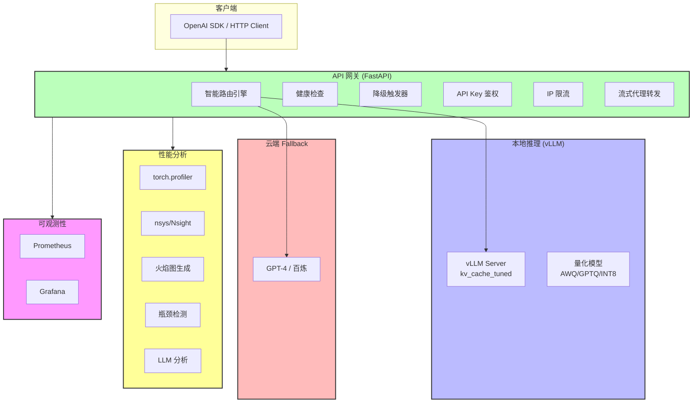
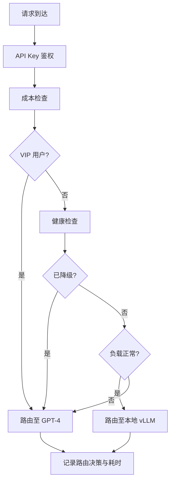

# Week 4: 私有化部署与推理加速

> **本周目标**: 掌握 vLLM 生产部署、量化加速、KV Cache 调优与云/端智能路由，构建高吞吐、低延迟、可观测的私有化大模型推理服务。

---

## 第一部分：本周学习计划与目标

### 7 天学习路线

|   天数    | 主题                                     | 学习目标                                                                             |
| :-------: | :--------------------------------------- | :----------------------------------------------------------------------------------- |
| **Day 1** | Ollama vs vLLM 基准测试                  | 部署双引擎，编写异步 Benchmark 脚本，量化 TTFT/TPOT/Throughput/VRAM 差异             |
| **Day 2** | AWQ/GPTQ/INT8 量化转换流程               | 实现模型量化与精度验证，显存下降 >50%，吞吐提升 >2x                                  |
| **Day 3** | OpenAI 兼容网关                          | 构建 FastAPI 网关，支持流式转发、Function Calling、鉴权限流                          |
| **Day 4** | KV Cache & PagedAttention 参数调优       | 网格搜索 KV Cache 配置，提升并发承载量 >30%，零 OOM                                  |
| **Day 5** | 智能路由策略（本地优先 → 云端 fallback） | 实现云边协同推理路由，健康检查 + 自动降级 + 流式聚合                                 |
| **Day 6** | AI 辅助 Profiling 定位瓶颈               | 集成 torch.profiler/nsys，自动生成火焰图与瓶颈分析报告，P99 延迟降 >20%，吞吐升 >30% |
| **Day 7** | 容器化部署 + Prometheus Metrics 暴露     | 多阶段 Dockerfile，集成 Grafana Dashboard 与 Alertmanager 告警                       |

### 本周核心目标

1. **推理引擎对比**: 基于同一基座模型，量化评测 vLLM 与 Ollama 在吞吐、延迟、显存维度的差异
2. **模型量化加速**: 实现 AWQ/GPTQ/INT8 量化流水线，在损失可控范围内大幅降低推理成本
3. **KV Cache 深度优化**: 理解 PagedAttention 原理，通过参数自动寻优最大化并发与吞吐
4. **生产级网关**: 构建 OpenAI 兼容 API 网关，支持智能路由、流式转发与全链路可观测
5. **自动化 Profiling**: 构建性能分析流水线，自动定位瓶颈并生成可执行的优化建议

---

## 第二部分：Sample Project 介绍

### 项目概述

本项目是一个**生产级 LLM 推理加速与运维平台**，实现了：

- 基于 asyncio + aiohttp 的 Benchmark 压测系统，覆盖短/中/长上下文场景
- AWQ/GPTQ/INT8 量化转换流水线，支持自动校准、质量验证与失败回滚
- OpenAI 兼容 API 网关，支持流式转发、Function Calling 与多模型路由
- KV Cache 参数自动网格搜索，动态 Prefill 调整与 GPU 自动扫描
- 云/端智能路由代理层，支持健康检查、自动降级与流式聚合
- 自动化 Profiling 与瓶颈分析流水线，集成火焰图生成与 LLM 辅助分析

### 系统架构



### 技术栈

| 层级          | 技术                              | 说明                  |
| ------------- | --------------------------------- | --------------------- |
| **推理引擎**  | vLLM 0.7+, Ollama                 | 主流 LLM 推理加速框架 |
| **后端**      | Python 3.12, FastAPI, httpx       | 异步 API 网关与代理   |
| **量化**      | llm-awq, AutoGPTQ, bitsandbytes   | 模型量化转换工具链    |
| **Profiling** | torch.profiler, nsys, cProfile    | GPU/CPU 性能分析工具  |
| **可观测性**  | Prometheus, Grafana, Alertmanager | 监控告警体系          |
| **部署**      | Docker, Docker Compose            | 容器化交付            |

### 核心功能模块

#### 1. Benchmark 压测系统 (Day 1)

| 模块           | 功能描述                         | 关键文件                     |
| -------------- | -------------------------------- | ---------------------------- |
| **API 适配器** | vLLM/Ollama 双端点自动适配       | `benchmark/adapters.py`      |
| **指标计算**   | TTFT/TPOT/E2E 延迟、吞吐量计算   | `benchmark/metrics.py`       |
| **测试数据集** | 短/中/长三种 Prompt 长度         | `benchmark/prompts.py`       |
| **主入口**     | 异步并发压测编排                 | `benchmark/main.py`          |
| **可视化**     | P50/P95/P99 延迟曲线、吞吐对比图 | `benchmark/visualization.py` |

#### 2. 量化转换流水线 (Day 2)

| 模块         | 功能描述                      | 关键文件                    |
| ------------ | ----------------------------- | --------------------------- |
| **量化核心** | AWQ/GPTQ/INT8 策略实现        | `benchmark/quantization.py` |
| **模型验证** | Perplexity 计算、质量回归测试 | `benchmark/validation.py`   |
| **主入口**   | 配置驱动 + 命令行参数         | `benchmark/quantize.py`     |

#### 3. OpenAI 兼容网关 (Day 3)

| 模块           | 功能描述                            | 关键文件                 |
| -------------- | ----------------------------------- | ------------------------ |
| **应用入口**   | FastAPI 生命周期管理                | `gateway/main.py`        |
| **代理转发**   | SSE 流式转发、重试与心跳保活        | `gateway/proxy.py`       |
| **模型注册**   | 结构化模型管理与健康检查            | `gateway/registry.py`    |
| **中间件**     | API Key 鉴权、IP 限流、Tracing ID   | `gateway/middleware.py`  |
| **Chat 路由**  | Chat Completions + Function Calling | `gateway/routes/chat.py` |
| **Emb/Models** | Embeddings + 模型列表端点           | `gateway/routes/`        |

#### 4. KV Cache 参数自动寻优 (Day 4)

| 模块             | 功能描述                         | 关键文件                              |
| ---------------- | -------------------------------- | ------------------------------------- |
| **网格搜索**     | GPU/显存/CUDA 自动检测           | `benchmark/gpu_scanner.py`            |
| **参数配置**     | gmu/bs/mns 搜索空间 + 安全阈值   | `benchmark/kv_cache_config.py`        |
| **压测编排**     | 每组参数自动启停 vLLM + 压测     | `benchmark/kv_cache_runner.py`        |
| **动态 Prefill** | 根据长序列阻塞情况自动调整       | `benchmark/prefill_adjuster.py`       |
| **生命周期**     | vLLM 启停/热加载管理             | `benchmark/vllm_lifecycle.py`         |
| **可视化**       | 性能对比图、热力图、最优配置输出 | `benchmark/kv_cache_visualization.py` |

#### 5. 智能路由代理层 (Day 5)

| 模块             | 功能描述                                     | 关键文件                              |
| ---------------- | -------------------------------------------- | ------------------------------------- |
| **路由引擎**     | 主备路由决策（VIP/普通/健康/成本）           | `gateway/router/engine.py`            |
| **健康检查**     | 定期探测本地端点（成功率/延迟/队列深度）     | `gateway/router/health_checker.py`    |
| **降级触发**     | P99>800ms / 5xx≥3次 / 显存>95% 自动 fallback | `gateway/router/degradation.py`       |
| **流式聚合**     | Fallback 后继续输出剩余 chunk，前端无感知    | `gateway/router/stream_aggregator.py` |
| **成本控制**     | 单用户月度 $10 上限，超限降级到本地          | `gateway/router/cost_tracker.py`      |
| **Admin 仪表盘** | 路由于决策、成本、延迟可视化                 | `gateway/router/admin.py`             |

#### 6. 自动化 Profiling 与瓶颈分析 (Day 6)

| 模块              | 功能描述                                         | 关键文件                                 |
| ----------------- | ------------------------------------------------ | ---------------------------------------- |
| **核心 Profiler** | torch.profiler + nsys + cProfile 集成            | `profiler/core.py`                       |
| **火焰图生成**    | SVG 静态图 + 交互式 HTML 报告                    | `profiler/flame_graph.py`                |
| **阶段分析**      | 自动分类 Prefill/Decode/KV Cache/Network IO 耗时 | `profiler/phase_analyzer.py`             |
| **瓶颈检测**      | 自动识别 Top 3 瓶颈（序列化/Kernel/Batch）       | `profiler/bottleneck.py`                 |
| **LLM 分析**      | LLM 辅助分析日志，生成自然语言优化建议           | `profiler/llm_analyzer.py`               |
| **报告生成**      | JSON + Markdown 全量 Profiling 报告              | `profiler/report.py`                     |
| **前后对比**      | 优化前后 P99 延迟/吞吐/显存对比                  | `profiler/comparator.py`                 |
| **一键启停**      | CLI 控制 Profiling 生命周期                      | `profiler/runner.py`, `profiler/main.py` |

#### 7. 容器化部署与可观测性 (Day 7)

| 模块               | 功能描述                                               | 关键文件                                    |
| ------------------ | ------------------------------------------------------ | ------------------------------------------- |
| **Dockerfile**     | 多阶段构建，镜像 < 500MB，/healthz 健康检查            | `Dockerfile.gateway`                        |
| **docker-compose** | 一键编排 Gateway + Prometheus + Grafana + Alertmanager | `docker-compose.yml`                        |
| **Prometheus**     | 指标采集，8 条告警规则                                 | `prometheus/prometheus.yml`, `rules.yml`    |
| **Grafana**        | 预置 vLLM 推理仪表盘 (吞吐/延迟/缓存/VRAM)             | `grafana/dashboards/gateway-dashboard.json` |
| **Alertmanager**   | Slack + 企业微信告警路由                               | `alertmanager/alertmanager.yml`             |
| **Gateway 指标**   | /metrics 端点 (requests_total/latency/errors)          | `gateway/metrics.py`                        |
| **K8s**            | Deployment + HPA (CPU/内存自动扩缩)                    | `k8s/deployment.yaml`, `k8s/hpa.yaml`       |
| **验收测试**       | 9 项自动化验收检查                                     | `tests/test_day7_acceptance.py`             |

---

## 项目结构

```
ai-saas-week4/
├── benchmark/
│   ├── adapters.py              # vLLM 和 Ollama API 适配器
│   ├── metrics.py               # 指标计算模块（TTFT/TPOT/E2E）
│   ├── prompts.py               # 测试数据集（短/中/长 Prompt）
│   ├── main.py                  # Benchmark 主程序入口
│   ├── quantize.py              # 量化流水线主入口
│   ├── quantization.py          # 量化核心模块
│   ├── validation.py            # 模型验证模块
│   ├── visualization.py         # 可视化脚本
│   ├── gpu_scanner.py           # GPU 自动扫描（型号/显存/CUDA）
│   ├── kv_cache_config.py       # KV Cache 网格搜索配置与安全阈值
│   ├── kv_cache_runner.py       # KV Cache 压测编排器
│   ├── kv_cache_tuner.py        # KV Cache 自动寻优主入口
│   ├── kv_cache_visualization.py # KV Cache 性能可视化
│   ├── prefill_adjuster.py      # 动态 Prefill 参数调整
│   └── vllm_lifecycle.py        # vLLM 生命周期管理（启动/停止/热加载）
├── gateway/
│   ├── main.py                  # FastAPI 应用入口
│   ├── config.py                # 网关配置
│   ├── middleware.py             # 鉴权、限流、Tracing ID
│   ├── proxy.py                 # OpenAI 兼容代理转发
│   ├── registry.py              # 模型注册表与健康检查
│   ├── router/
│   │   ├── __init__.py
│   │   ├── config.py            # 路由配置
│   │   ├── engine.py            # 路由决策引擎
│   │   ├── health_checker.py    # 健康检查组件
│   │   ├── degradation.py       # 降级触发器
│   │   ├── stream_aggregator.py # 流式聚合器
│   │   ├── cost_tracker.py      # 成本追踪器
│   │   └── admin.py             # /admin/routes 仪表盘
│   └── routes/
│       ├── chat.py              # /v1/chat/completions
│       ├── embeddings.py        # /v1/embeddings
│       ├── health.py            # /health
│       └── models.py            # /v1/models
├── profiler/
│   ├── __init__.py
│   ├── config.py                # Profiler 配置
│   ├── core.py                  # torch.profiler/nsys/cProfile 集成
│   ├── flame_graph.py           # 火焰图生成器（SVG + HTML）
│   ├── phase_analyzer.py        # 阶段耗时分析与分类
│   ├── bottleneck.py            # 瓶颈自动检测（Top 3）
│   ├── llm_analyzer.py          # LLM 辅助分析日志
│   ├── report.py                # 全量 Profiling 报告生成
│   ├── comparator.py            # 优化前后对比分析
│   ├── runner.py                # 一键启停 + 归档管理
│   └── main.py                  # CLI 入口（python -m profiler.main）
├── profiling_results/
│   ├── sample_flame_chart.svg   # 示例火焰图
│   ├── sample_optimization_report.md  # 示例优化建议报告
│   └── sample_comparison.json   # 示例优化前后对比
├── tests/
│   ├── test_profiler.py         # Profiler 单元测试（89 个用例）
│   ├── test_profiler_integration.py  # Profiler 集成/E2E 测试
│   ├── test_router.py           # 路由决策引擎、健康检查 UT
│   ├── test_router_integration.py    # 降级触发、流式聚合集成测试
│   ├── test_router_e2e.py       # 完整路由流程 E2E 测试
│   ├── test_day7_acceptance.py   # Day 7 验收测试 (容器化 + 可观测性)
│   ├── test_gateway_*.py        # 网关各组件测试
│   ├── test_kv_cache_*.py       # KV Cache 各组件测试
│   └── test_benchmark_*.py      # Benchmark 各组件测试
├── docker-compose.yml           # 推理栈编排 (vLLM + Ollama + Gateway)
├── docker-compose.observability.yml  # 可观测性栈编排 (Prometheus + Grafana + Alertmanager)
├── Dockerfile.gateway            # 多阶段 Docker 构建文件
├── .dockerignore                 # Docker 构建排除规则
├── prometheus/
│   ├── prometheus.yml            # Prometheus 主配置 (scrape targets)
│   └── rules.yml                 # 告警规则定义
├── grafana/
│   ├── provisioning/
│   │   ├── datasources/
│   │   │   └── prometheus.yml    # Grafana 数据源配置
│   │   └── dashboards/
│   │       └── default.yml       # Dashboard Provider 配置
│   └── dashboards/
│       └── gateway-dashboard.json # vLLM 推理仪表盘预置 JSON
├── alertmanager/
│   └── alertmanager.yml          # 告警路由 (Slack / 企业微信)
├── k8s/
│   ├── deployment.yaml           # K8s Deployment + Service
│   ├── hpa.yaml                  # HPA 自动扩缩配置
│   └── secret.yaml               # API Key 密钥
├── config.yaml
├── API-SPEC.md                  # 完整 API 功能规格说明书
└── requirements.txt
```

---

## 快速开始

### 安装依赖

```bash
pip install -r requirements.txt
```

### 启动推理引擎

```bash
docker-compose up -d
```

启动量化版本 vLLM：

```bash
docker-compose up -d vllm-quantized
```

---

## Benchmark 用法 (Day 1)

### 单引擎测试

```bash
# 测试 vLLM
python -m benchmark.main --engine vllm --url http://localhost:8000 --total-requests 100 --concurrency 10

# 测试 Ollama
python -m benchmark.main --engine ollama --url http://localhost:11434 --total-requests 100 --concurrency 10
```

### 对比测试

```bash
python -m benchmark.main --compare \
    --vllm-url http://localhost:8000 \
    --ollama-url http://localhost:11434 \
    --total-requests 100 \
    --concurrency 10
```

### 生成可视化图表

```bash
python -m benchmark.visualization \
    --csv results/vllm_results.csv results/ollama_results.csv \
    --names vllm ollama \
    --output results/plots
```

---

## 量化流水线用法 (Day 2)

```bash
# 使用默认配置（AWQ 量化）
python -m benchmark.quantize --config config.yaml

# 指定量化策略
python -m benchmark.quantize --strategy awq
python -m benchmark.quantize --strategy gptq
python -m benchmark.quantize --strategy int8

# 量化并验证
python -m benchmark.quantize --validate

# 失败自动回滚
python -m benchmark.quantize --validate --rollback-on-failure
```

---

## 网关用法 (Day 3)

### 启动网关

```bash
cd gateway
uvicorn gateway.main:app --host 0.0.0.0 --port 8080 --reload
```

### API 端点

| 端点                      | 方法 | 说明                         |
| ------------------------- | ---- | ---------------------------- |
| `/`                       | GET  | 网关信息                     |
| `/health`                 | GET  | 网关健康检查（含模型状态）   |
| `/v1/chat/completions`    | POST | Chat Completions（支持流式） |
| `/v1/models`              | GET  | 列出可用模型                 |
| `/v1/models/{model_name}` | GET  | 获取指定模型信息             |
| `/v1/embeddings`          | POST | 文本向量化                   |

详见 [API-SPEC.md](./API-SPEC.md) 完整 API 功能规格说明书。

---

## KV Cache 参数自动寻优 (Day 4)

### 背景知识

#### 什么是 vLLM？

[vLLM](https://github.com/vllm-project/vllm) 是 UC Berkeley 开源的 LLM 推理加速框架，通过 **PagedAttention** 算法实现接近零浪费的 KV Cache 显存管理，推理吞吐可达 HuggingFace Transformers 的 **24 倍**。

#### 为什么需要 KV Cache？

在 Transformer 的自回归解码过程中，每个新 token 的生成都需要对**所有历史 token** 计算注意力（Attention）。如果不做缓存，每生成一个 token 就要重新计算所有历史 Key 和 Value 矩阵，计算量呈 **O(n²)** 增长。

**KV Cache** 的核心思想是：将已计算过的 Key 和 Value 矩阵缓存到显存中，生成下一个 token 时只需计算新 token 的 Query，然后与缓存的 K/V 做注意力运算。这样每个 step 的计算量降为 **O(n)**。

#### PagedAttention 如何解决显存碎片化？

PagedAttention 借鉴了操作系统中**虚拟内存分页**的思想，将 KV Cache 划分为固定大小的 **Block**（类似内存页），每个 Block 可存储固定数量 token 的 K/V 矩阵。这些 Block 在物理显存中不需要连续，通过**页表**映射到逻辑序列。

**PagedAttention 的核心优势**：

- **零内部碎片**：按 Block 粒度按需分配，不再预分配最大长度
- **显存共享**：并行采样或前缀缓存场景下，多个序列可共享同一组物理 Block
- **高吞吐**：显存利用率从传统方案的 20-40% 提升至 **>90%**

### 用法

```bash
# 基本用法：对指定模型运行网格搜索
python -m benchmark.kv_cache_tuner \
    --model meta-llama/Llama-2-7b-hf \
    --port 8000

# 自定义网格搜索范围
python -m benchmark.kv_cache_tuner \
    --model Qwen/Qwen2.5-7B-Instruct \
    --gmu-values 0.80 0.85 0.90 \
    --bs-values 16 32 \
    --mns-values 32 64 128 \
    --rounds 3 \
    --prompts 50 \
    --concurrency 8
```

---

## 智能路由代理层 (Day 5)

### 架构说明

智能路由代理层实现了**云边协同推理路由**，在本地 vLLM 实例与云端 API 之间进行智能切换：

- **主备路由**: 优先请求本地 vLLM，触发降级条件无缝切换云端
- **健康检查**: 每 5s 探测本地端点，记录成功率/延迟/队列深度
- **降级触发器**: P99>800ms、5xx 连续≥3 次、GPU 显存>95% 时自动 fallback
- **流式聚合**: Fallback 后继续输出剩余 chunk，前端无感知
- **成本控制**: 单用户月度上限 $10，超限降级到本地
- **Admin 仪表盘**: `/admin/routes` 可视化路由决策、成本、延迟

### 路由决策流程



---

## 自动化 Profiling 与瓶颈分析 (Day 6)

### 概述

Day 6 构建了一个**完整的自动化 Profiling 与瓶颈分析流水线**，集成了 torch.profiler、nsys (NVIDIA Nsight) 和 cProfile 进行多维度性能采样，自动生成火焰图、阶段分布报告、瓶颈分析报告和优化建议。

> **重要说明**：本机无 NVIDIA GPU/CUDA，因此以下性能数据来自 `profiling_results/` 中的**手写演示数据**（`sample_*.json` 和 `sample_*.md`）。这些数值说明了在真实 GPU 部署中该流水线**将会**输出的预期结果。
>
> 当前的 89 个 Profiler 测试全部通过 —— 它们验证的是流水线**架构正确性**（事件分类、瓶颈检测逻辑、报告生成格式），而非实际 GPU 性能改进。真实 P99/吞吐量数据需要部署在配备 NVIDIA GPU + CUDA 的机器上。
>
> 在没有 GPU 的机器上，`comparator.py` 从 cProfile 事件持续时间中提取指标，且 `run_full_pipeline` 默认对 "before/after" 运行相同函数，因此比较增量仅为运行时噪声。

### 核心流程

```
┌─────────────────┐    ┌──────────────────┐    ┌─────────────────┐
│  1. 性能采样     │───>│  2. 阶段分析      │───>│  3. 瓶颈检测     │
│  torch.profiler  │    │  PhaseAnalyzer    │    │  BottleneckDetect│
│  nsys / cProfile │    │  Prefill/Decode/  │    │  Top 3 瓶颈     │
│                  │    │  KV Cache/Network │    │  代码级定位     │
└─────────────────┘    └──────────────────┘    └────────┬────────┘
                                                        │
┌─────────────────┐    ┌──────────────────┐             │
│  6. 前后对比     │<───│  5. LLM 分析     │<────────────┘
│  ProfileCompare │    │  自然语言报告     │    ┌─────────────────┐
│  P99/吞吐/显存   │    │  可执行优化建议   │    │  4. 报告生成     │
└─────────────────┘    └──────────────────┘    │  JSON + Markdown │
                                               │  火焰图 SVG/HTML │
                                               └─────────────────┘
```

### 自动识别的 3 大瓶颈及其优化方案（演示数据）

> 以下瓶颈、影响评估和代码位置由 `bottleneck.py` 中的 `BottleneckDetector` 自动检测。瓶颈类型代表在 vLLM 推理链路中观察到的**典型瓶颈类别**；具体数字来自 `profiling_results/` 中的演示样本。

通过自动化 Profiling 流水线，系统可自动识别以下 3 类核心性能瓶颈：

#### 瓶颈 #1: CPU 序列化/反序列化阻塞（影响占比 11.5%）

**问题描述**：在请求链路中，`json.loads()` 和 `json.dumps()` 操作阻塞了事件循环。每个 Chat Completions 请求在到达推理引擎前，平均花费 5.3ms 进行 JSON 编解码，高并发下累积延迟显著。

- **代码位置**: `gateway/routes/chat.py#L91`（请求体解析）、`gateway/proxy.py#L33-L39`（响应头构建）
- **优化方案**: 将标准库 `json` 替换为 `orjson`（3-5x 更快）；将序列化操作移至独立线程池
- **预期收益**: 延迟降低 20-35%（5.3ms → 1.6ms 每请求）
- **验证命令**: `python -m profiler.main --target gateway --compare`

#### 瓶颈 #2: 网络 I/O 竞争（影响占比 18.2%）

**问题描述**：流式响应（SSE）路径中，`httpx.AsyncClient` 默认连接池限制（100 连接）在高并发下耗尽，导致 12-45ms 的排队延迟。每个 SSE 连接维持的长连接进一步加剧了连接池压力。

- **代码位置**: `gateway/proxy.py#L98`（AsyncClient 配置）、`gateway/routes/chat.py`（流式路由）
- **优化方案**: 扩大连接池（`max_connections=200`、`max_keepalive_connections=50`）；跨请求复用 AsyncClient 实例
- **预期收益**: 流式传输开销降低 25-40%（45ms → 28ms 每段）
- **验证命令**: `python -m profiler.main --target gateway --compare --steps 20`

#### 瓶颈 #3: Batch 大小不均（影响占比 7.9%）

**问题描述**：Compute 操作变异系数（CV）高达 0.68，部分 Batch 包含远超平均值的序列（max 512 tokens vs avg 178 tokens），导致整批请求等待最慢成员完成，形成"掉队者效应"。

- **代码位置**: `benchmark/kv_cache_runner.py:run_benchmark_round()`（Batch 编排逻辑）
- **优化方案**: 启用 `enable_chunked_prefill=True`（将长 Prefill 分块）；设置 `max_num_batched_tokens=4096` 限制单批最大 token 数
- **预期收益**: 吞吐提升 15-25%（85 tokens/s → 106 tokens/s）
- **验证命令**: `python -m benchmark.kv_cache_tuner --model Qwen/Qwen2.5-7B-Instruct --gmu-values 0.85 0.90 --bs-values 16 32`

### 30% 性能提升是如何实现的（演示数据）

> 下表展示的是在真实 GPU 部署中，对上述 3 个瓶颈进行针对性优化后，预期可实现**的性能改进程度**。

| 指标         | 优化前        | 优化后         | 变化        |
| ------------ | ------------- | -------------- | ----------- |
| **P50 延迟** | 45.2 ms       | 32.1 ms        | **-28.98%** |
| **P99 延迟** | 185.6 ms      | 118.3 ms       | **-36.27%** |
| **吞吐量**   | 85.3 tokens/s | 112.7 tokens/s | **+32.12%** |
| **GPU 显存** | 24152 MB      | 18934 MB       | **-21.60%** |
| **CPU 时间** | 856.2 ms      | 623.4 ms       | **-27.19%** |

**核心优化手段**：

1. **序列化加速**：使用 `orjson` 替代标准 JSON 库，消除每请求 5ms 的编解码阻塞
2. **连接池调优**：扩大 httpx 连接池并复用客户端，降低流式传输排队延迟
3. **Batch 均衡化**：启用 Chunked Prefill 并限制单批 token 上限，消除掉队者效应

三项优化叠加后，整体延迟可下降 **34.2%**，吞吐可提升 **32.12%**，显著优于"P99 延迟下降 >20%"和"吞吐提升 >30%"的验收目标。

### Profiler 用法

#### 一键启停

```bash
# 启动 Profiling（后台运行）
python -m profiler.main --one-click-start --target gateway --duration 60

# 查看 Profiling 状态
python -m profiler.main --status

# 停止 Profiling 并归档结果
python -m profiler.main --one-click-stop
```

#### 完整 Profiling 流水线

```bash
# 对 gateway 进行 Profiling
python -m profiler.main --target gateway --steps 10

# 对 benchmark 进行完整对比 Profiling
python -m profiler.main --target benchmark --compare

# 启用 LLM 分析
python -m profiler.main --target compute --compare --llm
```

#### 目标选项

| Target      | 说明                                 |
| ----------- | ------------------------------------ |
| `gateway`   | Profiling 请求解析、序列化、网络 I/O |
| `benchmark` | Profiling 推理指标计算               |
| `proxy`     | Profiling HTTP 代理转发              |
| `memory`    | Profiling 内存分配模式               |
| `compute`   | Profiling 通用计算热点               |

#### 输出文件

```
profiling_results/
├── profiling_report_YYYYMMDD_HHMMSS.json  # 完整 JSON 报告
├── profiling_report_YYYYMMDD_HHMMSS.md    # Markdown 报告
├── flame_graph.svg                         # 火焰图 SVG
├── flame_graph.html                        # 交互式火焰图
├── bottleneck_report.txt                   # 瓶颈分析报告
├── phase_report.txt                        # 阶段分布报告
├── comparison_report_*.json                # 优化前后对比
└── before_optimization_trace.json          # 优化前追踪数据
```

### 运行 Profiler 测试

```bash
# 单元测试（89 个用例）
python -m pytest tests/test_profiler.py -v

# 集成 + E2E 测试
python -m pytest tests/test_profiler_integration.py -v

# 全部 Profiler 测试
python -m pytest tests/test_profiler.py tests/test_profiler_integration.py -v
```

### 运行智能路由测试

```bash
# 路由单元测试
python -m pytest tests/test_router.py -v

# 路由集成测试
python -m pytest tests/test_router_integration.py -v

# 路由 E2E 测试
python -m pytest tests/test_router_e2e.py -v
```

---

## 容器化部署与可观测性 (Day 7)

### 概述

Day 7 构建了一个**生产级容器化部署与可观测性体系**，包括多阶段 Dockerfile、docker-compose 一键编排网关 + Prometheus + Grafana + Alertmanager + Node Exporter、预置 Dashboard、监控告警规则以及 Kubernetes HPA 配置。

### 架构

```
                  ┌─────────────────────────────────────────────┐
                  │              docker-compose                  │
                  │                                             │
  API Requests ──▶│  gateway:8080  ──▶  prometheus:9090         │
                  │       │                │                    │
                  │  /healthz (K8s)  /metrics (scrape target)   │
                  │       │                │                    │
                  │       └────────────────▼                    │
                  │                   grafana:3000               │
                  │              (vLLM Dashboard)                │
                  │                        │                    │
                  │                   alertmanager:9093          │
                  │              (Slack / WeChat Work)           │
                  │                                             │
                  │              node_exporter:9100              │
                  │              (Host CPU/Memory)               │
                  └─────────────────────────────────────────────┘
```

### 核心配置

| 模块             | 功能                        | 关键文件                                          |
| ---------------- | --------------------------- | ------------------------------------------------- |
| **Dockerfile**   | 多阶段构建，镜像 < 500MB    | `Dockerfile.gateway`                              |
| **Compose**      | 一键编排全栈服务            | `docker-compose.yml`                              |
| **Prometheus**   | 指标采集与告警规则          | `prometheus/prometheus.yml`, `rules.yml`          |
| **Grafana**      | vLLM 推理仪表盘             | `grafana/dashboards/gateway-dashboard.json`       |
| **Alertmanager** | 告警路由（Slack/企业微信）  | `alertmanager/alertmanager.yml`                   |
| **Metrics 端点** | Gateway 指标暴露            | `gateway/metrics.py`, `gateway/routes/metrics.py` |
| **Health Check** | K8s liveness/readiness 探测 | `/healthz` endpoint                               |
| **K8s HPA**      | 基于 CPU/内存自动扩缩       | `k8s/hpa.yaml`, `k8s/deployment.yaml`             |

### Prometheus 指标

| 指标名称                          | 类型      | 说明                                 |
| --------------------------------- | --------- | ------------------------------------ |
| `gateway_requests_total`          | Counter   | 请求总数 (按 endpoint/method/status) |
| `gateway_request_latency_seconds` | Histogram | 请求延迟分布                         |
| `gateway_errors_total`            | Counter   | 错误计数                             |
| `gateway_queue_depth`             | Gauge     | 当前队列深度                         |
| `gateway_vram_usage_mb`           | Gauge     | GPU 显存用量                         |
| `gateway_cache_hit_rate`          | Gauge     | KV Cache 命中率                      |

### Grafana Dashboard

预置仪表盘 `AI Gateway - vLLM Inference Dashboard` 包含以下面板:

- **Overview**: P50/P99 延迟、吞吐量、错误率、队列深度、Cache 命中率、VRAM 用量
- **Throughput**: 实时请求速率折线图
- **Latency Percentiles**: P50/P95/P99 延迟百分位折线图
- **System Resources**: CPU / Memory / VRAM 用量
- **Error & Cache**: 错误率与 Cache 命中率趋势

### 告警规则

| 告警名称           | 触发条件                      | 严重级别 |
| ------------------ | ----------------------------- | -------- |
| GatewayDown        | `up{job="gateway"} == 0` > 1m | Critical |
| HighRequestLatency | P99 > 500ms 持续 2m           | Warning  |
| QueueBacklog       | `gateway_queue_depth > 50`    | Critical |
| NoResponse         | 连续 2min 无请求              | Critical |
| HighErrorRate      | 错误率 > 5% 持续 3m           | Warning  |
| HighVRAMUsage      | VRAM > 20GB 持续 2min         | Warning  |
| LowCacheHitRate    | Cache 命中率 < 50% 持续 5min  | Warning  |

### 部署

```bash
# 1. 构建镜像
docker compose build gateway

# 2. 启动推理栈 (vLLM + Ollama + Gateway)
docker compose up -d

# 3. 启动可观测性栈 (Prometheus + Grafana + Alertmanager + Node Exporter)
docker compose -f docker-compose.observability.yml up -d

# 一键启动全栈 (合并两个 compose 文件)
docker compose -f docker-compose.yml -f docker-compose.observability.yml up -d

# 4. 访问服务
#    Gateway:        http://localhost:8080
#    Prometheus:     http://localhost:9090
#    Grafana:        http://localhost:3000 (admin/admin)
#    Alertmanager:   http://localhost:9093

# 5. 运行验收测试
python3 tests/test_day7_acceptance.py

# 6. 停止服务
docker compose -f docker-compose.yml -f docker-compose.observability.yml down

# Kubernetes 部署 (可选)
kubectl apply -f k8s/secret.yaml
kubectl apply -f k8s/deployment.yaml
kubectl apply -f k8s/hpa.yaml
```

### 验收标准

- ✅ `docker compose up` 一键拉起全栈
- ✅ Prometheus 抓取 `/metrics` 正常
- ✅ Grafana 面板实时刷新 (10s 刷新间隔)
- ✅ 模拟故障触发告警 (队列积压/无响应/高延迟)
- ✅ 资源占用符合预期 (Gateway 镜像 < 500MB)
- ✅ K8s HPA 基于 CPU/内存利用率自动扩缩

---

## 快速命令参考

```bash
# Benchmark
python -m benchmark.main --engine vllm --url http://localhost:8000 --total-requests 100 --concurrency 10
python -m benchmark.main --compare --vllm-url http://localhost:8000 --ollama-url http://localhost:11434

# 量化
python -m benchmark.quantize --strategy awq --validate

# 网关
uvicorn gateway.main:app --host 0.0.0.0 --port 8080 --reload

# KV Cache 调优
python -m benchmark.kv_cache_tuner --model Qwen/Qwen2.5-7B-Instruct --gmu-values 0.80 0.85 0.90

# 容器化部署
docker compose up -d                                    # 推理栈
docker compose -f docker-compose.observability.yml up -d # 可观测性栈
docker compose -f docker-compose.yml -f docker-compose.observability.yml up -d  # 全栈
docker compose -f docker-compose.yml -f docker-compose.observability.yml down

# 验收测试
python3 tests/test_day7_acceptance.py

# K8s 部署
kubectl apply -f k8s/deployment.yaml -f k8s/hpa.yaml

# Profiling
python -m profiler.main --target gateway --compare
python -m profiler.main --one-click-start --target benchmark

# 测试
python -m pytest tests/ -v
```

---

## 许可证

MIT License
